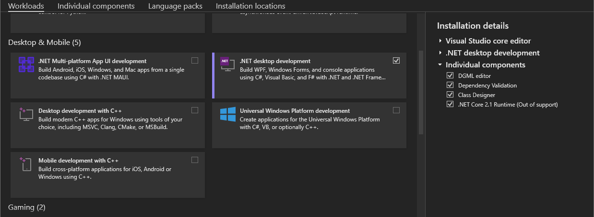
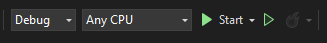

# Maxima Plugin for SMath Studio

- This repository serves as a copy of the original repository, which is available in the SVN of SMath. You can find it at [MaximaPlugin SVN](https://smath.com:8443/!/#public/view/head/plugins/MaximaPlugin/).
- Information about SMath Studio can be found in the [SMath website](https://smath.com/en-US).
- More information about the plugin can be found in the [SMath Forum Post](https://en.smath.com/forum/yaf_postst2078_Maxima-Plugin.aspx).

## Requirements for development:

- Visual Studio Community (any latest version of VS)
  [Download Visual Studio Community](https://visualstudio.microsoft.com/free-developer-offers/)
  
- SMath Studio
  [Download SMath Studio](https://smath.com/en-US/view/SMathStudio/download)

## Setting up working environment:

1. Download and install both of the required software into your computer. For Visual Studio, select the **.NET desktop development** under **Desktop & Mobile option**. 



2. Clone the MaximaPlugin project from GitHub by running the following command or you can download the project as a zip and extract it in any folder:
```
git clone https://github.com/fakemoses/MaximaPlugin
```
3. Open the project file (MaximaPlugin.csproj) using Visual Studio. You will get the following window (image).

4. If you have installed SMath in a different directory than C:\\ drive, unload the project by right-clicking on the MaximaPlugin in the Solution Explorer followed by "Unload Project". The MaximaPlugin.csproj will be opened, and it contains the XML file of the project that needs to be changed. Locate the following line and change the directory `C:\Program Files (x86)\SMath Studio` to wherever you have installed your SMath.

```xml
<!-- Debug -> development -->
<SMathDir Condition=" '$(SMathDir)' == '' AND '$(Configuration)' == 'Debug' ">
```

7. Right-click on the MaximaPlugin on the solution explorer again and click on reload project. 

8. Build the solution by clicking the build option on the top bar `Build > Build Solution` or by using the hotkey `Ctrl+Shift+B`

9. Now you can use the debug feature by clicking on the start button.



10. It is good to always rebuild the solution when ever you pulled the latest code from github.
