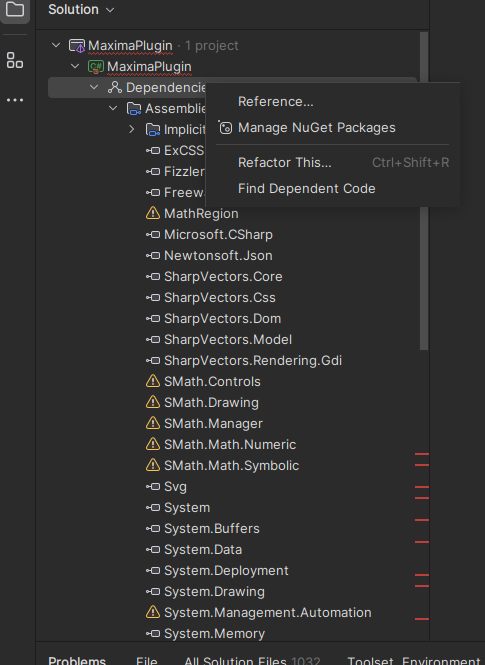
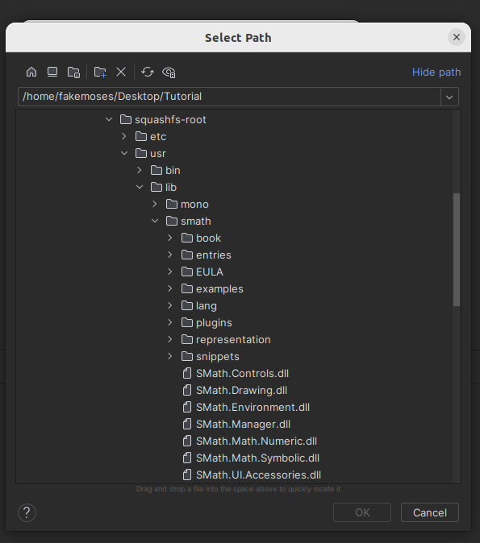
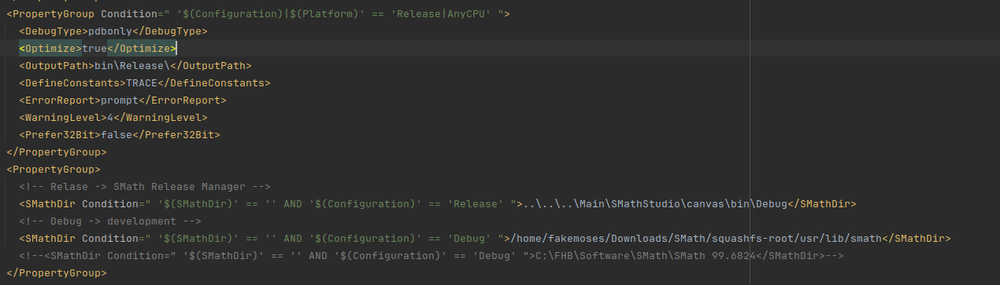
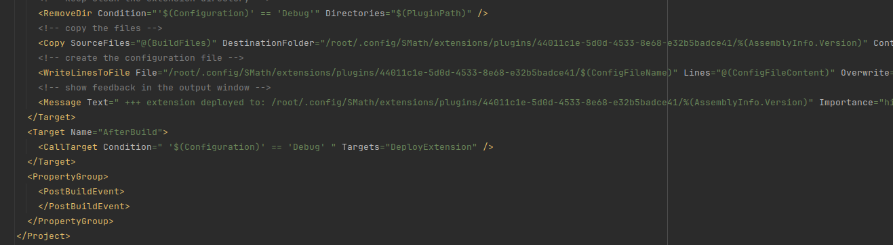
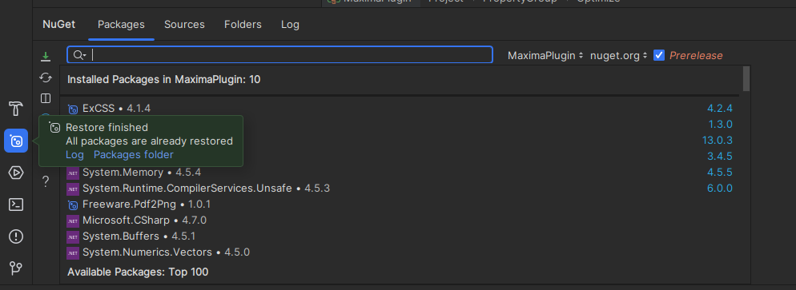

#Developer guide to setup working environment on Linux 

The following method is tested on **Ubuntu 22.04 LTS**. 

## 1. Downloading SMath and setting up the application

- SMath is available in form of AppImage. To enable debugging, developer must extract the content. Download the file from smath.com. Copy the file to any folder that the developer is using. For example:

    ```
    mkdir SMath

    cd SMath

    wget https://smath.com/en-US/Files/Download/H6hBX/SMathStudioDesktop.1_0_8348.x86_64.ubuntu-22_04.glibc2.35.AppImage

    chmod +x SMathStudioDesktop.1_0_8348.x86_64.ubuntu-22_04.glibc2.35.AppImage
    ```


- After a successful download, extract the AppImage by using the following command:

    ```
    ./SMathStudioDesktop.1_0_8348.x86_64.ubuntu-22_04.glibc2.35.AppImage --appimage-extract
    ```

- This will extract the content into a new folder called "squashfs-root" within the SMath folder in this example.
The folder will contain the following structure and SMath executable can be found in the directory **"/usr/lib/smath"** within the **"squashfs-root"** folder. This is relevant for later.

- Alternatively on older version of Ubuntu such as version 20.04.06 LTS, you can download the mono version instead and extract the tar.gz file. On older ubuntu you do not need Sudo to run the SMath Studio.

## 2. Setting up Rider and developer working environment 

- Now that the the extraction is successfully made, we are going to setup the working environment. The following method is tested only on Rider by Jetbrains. If you are a student, you can get the free education license. Download and Install Jetbrain Rider by running the following command:

    ```
    sudo snap install rider --classic
    ```

    Download or clone the project to a working folder. Remember the path for this folder! 

    ```
    https://github.com/fakemoses/MaximaPlugin
    ```

    Open the project using Rider as a sudo.

    ```
    sudo rider
    ```

- In Ubuntu 22.04 sudo is required to run the application later! Then register or login the Rider. 

- Then navigate to the SMath project folder and select the csproj file. Upon opening, Rider will complain about the missing dependencies. Here we must set the dependencies manually.

    

- Firstly to set the dependencies of the SMath files. Here we add the new location of the file and delete the older one. So Right click on the **Dependencies > Reference** . In the Add Reference, select the **"Add From.."**. A search dialog will be open. Now we point to files which can be found in the extracted SMath AppImage folder we created earlier. 

    

- After adding all five of the required SMath file for this project, we proceed to the MathRegion. This can be find within the same directory just now, namely within the plugins.

- Now we need to manually edit the csproj file so that the path for SMath executable, the path to copy the files are correct!

- Unload the project and first thing to be changed is the directory for the **"Solver.exe"**.

- Go to line 40, and change the path **"C:\Program Files (x86)\SMath Studio"** to the location of the extracted SMath file. Example is below.

    

- Then head to line 310,312,314 and 316. Change the **"\$(PluginPath)"** to the location of the plugin within the linux. When running the SMath as root, such as in this tutorial, the plugin directory can be found in **"/root/.config/SMath/extension"**. Replace the **"$(PluginPath)"** with for example in this case: 

    

- Reload the project. You should be able to build, and debug the plugin. If there is any problem with the external packages, right click on the project, click on the **"Manage NuGet package"** and and click on the restore package as shown below. 

    

## 3. Install Maxima 

- Install Maxima by running the following command: 

```
sudo apt install maxima
```