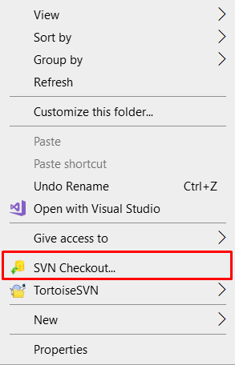
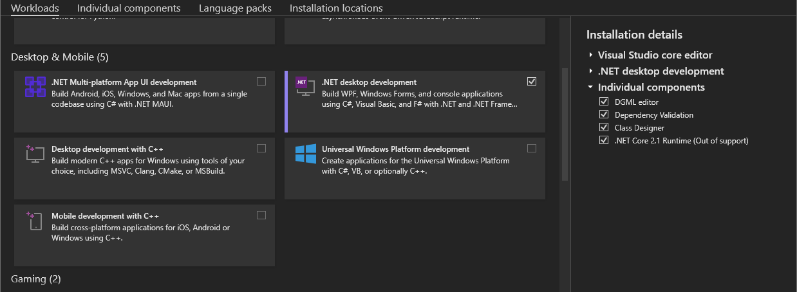
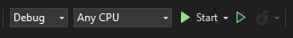

Getting Started - Developer Guide
================================

- This repository serves as a copy of the original repository, which is available in the SVN of SMath. You can find it at [MaximaPlugin SVN](https://smath.com:8443/!/#public/view/head/plugins/MaximaPlugin/).
- Information about SMath Studio can be found in the [SMath website](https://smath.com/en-US).
- More information about the plugin can be found in the [SMath Forum Post](https://en.smath.com/forum/yaf_postst2078_Maxima-Plugin.aspx).

Requirements for development:
------------------------------------

- Visual Studio Community (any latest version of VS)
  [Download Visual Studio Community](https://visualstudio.microsoft.com/free-developer-offers/)
  
- SMath Studio
  [Download SMath Studio](https://smath.com/en-US/view/SMathStudio/download)

Cloning the codebase
------------------------------------
### Cloning from GitHub

To clone the MaximaPlugin project from the GitHub repository, run the following command or you can download the project as a zip and extract it in any folder:
```
git clone https://github.com/fakemoses/MaximaPlugin
```
or using Github Desktop by clicking "File > Clone Repository" and paste the following link:

```
https://github.com/fakemoses/MaximaPlugin
```

### Cloning from SMath SVN Server

* To clone from the SMath SVN server, download the TortoiseSVN using the following link:
```
https://tortoisesvn.net/downloads.html
```
* Install the TortoiseSVN

* Head into your development directory and right-click to reveal the context menu and click on the "SVN Checkout..." as shown in the image below. 



* A window will pop out and paste the the following link into the "URL of repository": 
```
https://smath.com:8443/svn/public/plugins/MaximaPlugin/MaximaPlugin
```
* Click the "OK" button and it will start downloading the repository.

Setting up working environment:
------------------------------------

* Download and install both of the required software into your computer. For Visual Studio, select the **.NET desktop development** under **Desktop & Mobile option**. 



* Clone the project.
* Open the project file (MaximaPlugin.csproj) using Visual Studio.

* If you have installed SMath in a different directory than C:\\ drive, unload the project by right-clicking on the MaximaPlugin in the Solution Explorer followed by "Unload Project". The MaximaPlugin.csproj will be opened, and it contains the XML file of the project that needs to be changed. Locate the following line and change the directory `C:\Program Files (x86)\SMath Studio` to wherever you have installed your SMath.

```xml
<!-- Debug -> development -->
<SMathDir Condition=" '$(SMathDir)' == '' AND '$(Configuration)' == 'Debug' ">
```

* Right-click on the MaximaPlugin on the solution explorer again and click on reload project. 

* Build the solution by clicking the build option on the top bar `Build > Build Solution` or by using the hotkey `Ctrl+Shift+B`

* Now you can use the debug feature by clicking on the start button.

* On the event that the build failed due to the missing packages, install the following required packages from NuGet Package manager:
  * Newtonsoft.Json
  * Microsoft.CSharp
  * Microsoft.PowerShell.5.1.ReferenceAssemblies.1.0.0
  * Magick.NET-Q16-AnyCPU
  * Svg



* It is good to always rebuild the solution when ever you pulled the latest code from github.

Commiting changes
------------------------------------

1. To GitHub
  Assuming that you have the access, you can either use the commit feature of GitHub Desktop or run the commands via CLI. 
  ```
  https://docs.github.com/en/get-started/using-git/pushing-commits-to-a-remote-repository
  ```

2. To SMath SVN

  For SMath SVN, you are required to have an account to perform this account. You can request the owner of SMath Studio for this account by contacting him directly via Email. 

  * Right-click on the folder to reveal the context menu and click on the "SVN Commit.."
  * Write your commit message and click "OK".
  * For first time commit, you might be asked for the login credentials. Fill it in using the username & password that you got from the software owner.

NOTE WHEN COMMITTING CHANGES FOR PLUGIN RELEASE
------------------------------------

In the project file (.csproj), some small change has to be made in order to release it using the release manager or else it will fail. 

For any packages from NuGet, the pathing in the project file has to be changed. "../" must be added at the beginning of the path of the packages. For example:

In local environment:

```xml
<Reference Include="Freeware.Pdf2Png, Version=1.0.1.0, Culture=neutral, PublicKeyToken=0b93ff91d4be458d, processorArchitecture=MSIL">
  <HintPath>packages\Freeware.Pdf2Png.1.0.1\lib\net45\Freeware.Pdf2Png.dll</HintPath>
```

For release manager:
```xml
<Reference Include="Freeware.Pdf2Png, Version=1.0.1.0, Culture=neutral, PublicKeyToken=0b93ff91d4be458d, processorArchitecture=MSIL">
  <HintPath>../packages\Freeware.Pdf2Png.1.0.1\lib\net45\Freeware.Pdf2Png.dll</HintPath>
```

Releasing the Plugin
------------------------------------

The plugin can be released using the Release Manager. However, during the writing of the documentation, only the original author/product owner can perform this action. 
