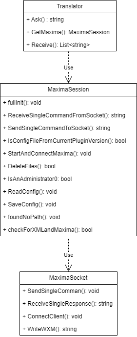
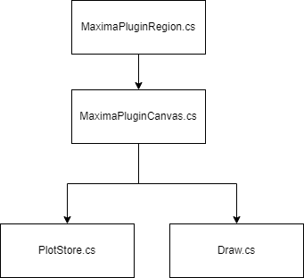

# Project Structure & Examples

## Folder in root directory
| Directory         | Description                                                                                                                             |
| ----------------- | --------------------------------------------------------------------------------------------------------------------------------------- |
| ControlObjects    | A collection of classes and components that manages translation and communication that is accessible by other classes. It also manage XML read-write  |
| Converter          | Houses classes and functions that are responsible for data conversion and formatting from SMath to Maxima and vice versa..                                                  |
| MForms            | Contains user interface forms and windows that are intrinsically tied to the project's functionality. These elements shape the user's interaction with the Plugin, creating an intuitive and user-friendly experience. |
| MFunctions        | Serves as the repository for various functions and methods that make up the core of the Plugin.                                       |
| MInstaller               | Contain the classes that handles URL extraction, file download and installation                                                           |
| PlotImage         | Contains classes and functions responsible for the plugin's image plotting and rendering capabilities.                               |
| Resources         | Contains assets such as logo and icon files for the plugin.                                                                           |
| lib               | Accommodates external libraries and dependencies required for the plugin.                                                           |

In the root folder, there are also the following files:

## Files in root directory
|Files | Description|
|-------------|-------------|
|MainClass.cs| Entry point for the plugin/codebase. Contain the implementation that defines the plugin functionalities |
|SharedFunctions.cs| Contain methods that are used by multiple classes throughout the codebase |
|MCustomGlyphs.cs| Manages the custom Glyphs for Maxima function and Cross product function|


# Main component of the project

Here the core component of the project and their locations are elaborated. The term function refer to SMath functions and the term method refer to the method of a class.

## 1. Entry point

The MainClass.cs is the entry point of this plugin. This file define many functionalities of the plugin such as the functions that is evaluated by the plugin, the menu bar items and many more. 

## 2. Utilities and Mathematical Functions

In this plugin, functions are categorized into three main types:

### Utility Functions
These functions perform additional tasks for the plugin. Examples include:
- `Maxima()`
- `MaximaTakeover()`
- `MaximaLog()`

### Symbolic alternatives Functions
Symbolic alternatives functions are one of the many mathematical functions of the plugin. Examples are:
- `Int()`
- `Det()`
- `Sum()`
- And many more.

### Wrapper Functions
Wrapper functions include:
- `Solve()`
- `Fit()`
- `Residual()`
- And many more.

You can find the methods responsible for processing these functions in the `MFunctions` folder within the following files:

| File Name           | Type of Functions            |
| ------------------- | ---------------------------- |
| MaximaAllround.cs   | Utility Functions           |
| DirectMaximaFunctions.cs | Wrapper Functions       |
| InternOverwrite.cs  | Symbolic Alternative Functions |

## 3. Translation Interface

The Translation Interface is responsible for the seamless translation of input and output between SMath and Maxima, ensuring smooth communication in both directions. 

In many classes throughout this plugin, the `Translator` class plays a vital role in handling this translation and communication process. You can locate the `Translator` class in the `CommunicationInterface.cs` file. Methods responsible for managing symbolic alternative functions and wrapper functions often make use of the `Ask()` method within the `Translator` class.

Classes related to this interface are distributed across various files and folders, specifically within the `ControlObjects` and `Converter` directories. Here is an overview of the class diagram:


## 4. Communication Interface

Communication Interface's primary responsibilities are to create a socket connection, connect Maxima, initialize Maxima, manage the session by facilitating the communication of SMath and Maxima, provide logging functionalities, and even manage the configuration files. Mainly, the communication interface for most classes begins in the `Ask()` method of the `Translator` class, where after the translation to Maxima is done, the input will be sent to Maxima, and output from Maxima is received and sent for translation to SMath. 

The files responsible for the Session management and socket management can be found under the folder `SessionManager`.




## 5. Draw Region and Draw Functions

1. Draw region are custom region canvas that is added onto the worksheet via the menu bar `Insert > Maxima > Draw2D / Draw3D`. It shows the plot generated by Maxima onto the canvas and user can interact with it by performing various actions such as panning, zooming, and even save the image as a file.

    The files that handles the draw region can be found in the folder `PlotImage`.

    

2. Draw functions is a bit different than the draw region. Just like mathematical functions, draw functions are functions that is callable by the user from the worksheet. Instead of showing image, the output of this function is the absolute path to the generated plot. The function itself is managed by `Draw()` method in the file `DirectMaximaFunction.cs`. However, the plot options are managed by the file `PlotStore.cs`. 


## 6. Maxima Automatic Installation

Within the folder `MInstaller` lies the classes that are responsible to perform HTTP request, extract the latest URL of Maxima from the JSON file, download the installer and execute the installer. This classes are used by the Settings Form which can be found in the folder `MForms`. 

In the following sections, examples will be elaborated.


# Examples

## 1. Create new SMath Function

In this creation we will use Cross product as an example.

1. Firstly in MainClass.cs under the IPluginHandleEvaluation.GetTermsHandled() method, add a new TermInfo(). Here, the definition of the function, the number of arguments and the type of arguments it takes are defined. Example is below:

    ```csharp
        new TermInfo ("Cross", TermType.Function,"Cross(expr" + sessionProfile.ArgumentsSeparator + " expr" + sessionProfile.ArgumentsSeparator + ") Returns the result of cross product. Inputs are in form of vector. Also support 2D-Vectors. " , FunctionSections.Unknown , true, new ArgumentInfo(ArgumentSections.Expression), new ArgumentInfo(ArgumentSections.Expression)),

    ```

2. Then in the same file under the IPluginLowLevelEvaluation.ExpressionEvaluation() method, we define the action that will be performed when the function "Cross" is called in SMath worksheet. In this case, we create a method in the file DirectMaximaFunction.cs which can be found in the folder MFunctions. 

    ```csharp
    if (root.Type == TermType.Function && root.Text == "Cross")
    {
        return MFunctions.DirectMaximaFunctions.CrossProduct(root, args, ref context, ref result);
    }
    ```

    Few important thing when creating a new method to handle a new SMath function, the method is always a boolean type which will return true. If it return false, it will not be evaluated. Then, the arguments are in form of SMath term. The answer/output must be converted to Terms using the TermsConverter class before being set to the result. Example code is below.

    ```csharp
            public static bool CrossProduct(Term root, Term[][] args, ref Store context, ref Term[] result)
            {
                var arg1 = SharedFunctions.Proprocessing(args[0]);
                var arg2 = SharedFunctions.Proprocessing(args[1]);

                // append all input as a single string of cross product command
                string stringtoMaxima = "(" + arg1 + ")" + "†" + "(" + arg2 + ");" + "express(%)";

                // send to Maxima and retrieve result
                string outputFromMaxima = ControlObjects.Translator.Ask(stringtoMaxima);

                //replace SMath list with mat
                outputFromMaxima = Regex.Replace(outputFromMaxima,@"sys", "mat");
                result = TermsConverter.ToTerms(outputFromMaxima);
                return true;
            }
    ```

## 2. Add new Item in Toolbox

Current the toolbox only support function without pre-defined arguments. To add a new button in the toolbox, we add a new ButtonMetaData into the GetToolboxGroups() method in the MainClass.cs. Here the size, description and the action will be defined. For the action it is adviseable to use the GetButtonAction() method that can be found in the class. For example:

```csharp
new ButtonsMetaData("Control")
    { Size = new Size(54, 24), Description = "Control Maxima process. E.g. Restarting the session by using MaximaControl(\"restart\")", Action = GetButtonAction("MaximaControl", 1, sessionProfile) },
```

## 3. Add new Item in Menu Bar

To add a new menu item in the menu bar, all you need is to add a new button in the IPluginCustomRegion.GetMenuItems() method in the MainClass.cs. The first argument is the name of the menu that will be visible to the user and the second argument is the function name. For example:

```csharp
menubutton.AppendChild("Restart", MRestart);
```


## 4. Adding new Plot Options

Plot options for both draw region and draw functions are managed by PlotStore class in the folder PlotImage. In this example, an existing plot option will be used.
For example, we want to add command that enable the x-Axis by default. 

1. Create a getter and setter 

    To manage the enablexAxis option, you need to create a getter and setter in the PlotStore class, typically located at the bottom of the class. Depending on the option you want to implement, you can use a boolean, string, or the enum State available in the class.

    ```csharp
    public bool enablexAxis
    {
        set { _enablexAxis = value; }
        get { return _enablexAxis; }
    }
    ```

2. Set Default Value:

    Next, set the default value or state of the plot option in the constructor. This ensures that the x-Axis is enabled by default.

    ```csharp
    enablexAxis = true;
    ```

3. Implement the option logic:

    In the MakeLists method, you can write the logic that represents your variable. Here, you decide whether to include specific commands or preambles in the final output. In this case, when enablexAxis is true, you want to configure the x-Axis and its characteristics.

    ```csharp
    if (enablexAxis)
    {
        commandList.Add("xaxis=true");
        commandList.Add("xaxis_type=" + xAxisType);
        commandList.Add("xaxis_color=" + xAxisColor);
        commandList.Add("xaxis_width=" + xaxisWidth);
    } 
    ```
    These steps allow you to manage and configure the enablexAxis option in the PlotStore class effectively. Adjust the logic as needed for other plot options, using this as a guide.

